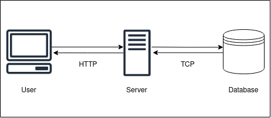

# Project Description
This project consists of a simple wallet management application where a user can make transactions of 2 types :
- **Deposit** : a user can add an amount of money to his/her wallet.
- **Withdraw** : a user can withdraw an amount of money from his/her wallet. 

## Project overall architecture 
This is a simple microservice using go and that communicates with a Postgresql database.

## ERD
To better understand the functionality, we need to mention that : 
- a user can have one or many wallets.
- a user can perform one or many transactions.

with that in mind the entity relationship diagram is as follows :

### DB Operations 

| | USER | WALLET | TRANSACTION |
|-|------|--------|-------------|
|Operations | Create| Create, Read, Update| Create, Read |

### Constraints 
* You cant withdraw a sum amount of money from a wallet where its balance is lesser than that amount.